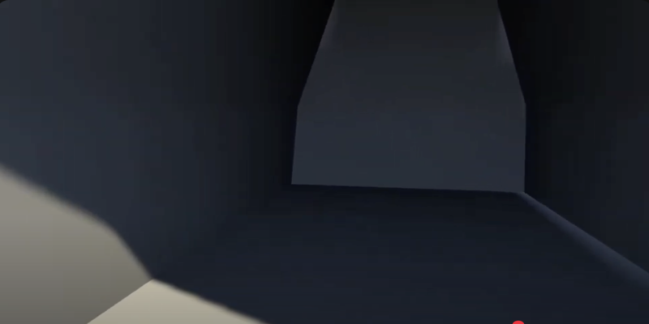

# Portals

A Unity-based 3D puzzle game inspired by Portal, focusing on teleportation mechanics and spatial puzzles.

## Description

Portals is a first-person puzzle game where players solve challenges by creating portals for teleportation between different areas. The game features:

- Portal mechanics that allow seamless teleportation between two locations  
- Physics-based puzzles that require creative thinking  
- Objects that maintain momentum through portals  
- Multiple puzzle chambers with increasing difficulty  

This project was created as part of CS50's Game Development course, demonstrating advanced concepts in 3D game development.

## How to Play

### Controls
- WASD: Movement  
- Mouse: Look around  
- Left-click: Place entrance portal  
- Right-click: Place exit portal  
- E: Interact with objects  
- Space: Jump  

### Objective  
Navigate through the test chambers by solving puzzles using the portal gun to create pathways between otherwise disconnected areas.

## Development

### Built With
- Unity Engine  
- C# for game logic and mechanics  
- Unity's physics system for momentum preservation  

### Project Structure
- `Assets/Scripts/` - Core C# scripts including portal logic and gameplay controllers  
- `Assets/Prefabs/` - Prefabs for portals, rooms, and player controllers  
- `Assets/Materials/` - Materials for portal effects, walls, and floors  
- `Assets/Scenes/` - Main game levels and testing scenes  
- `Assets/Shaders/` - Custom shaders for portal rendering and visual tricks  
- `Assets/Sounds/` - Sound effects for portals and interactions  
- `Assets/Textures/` - Render textures and UI-related textures  
- `Assets/FireFireWeapon/` - Additional 3D weapon models and prefabs  
- `Assets/ProCore/` - Third-party tools (ProBuilder, ProGrids) used for level creation  
- `Assets/Standard Assets/` - Unity's default assets including character controllers  
- `Assets/PhysicsMaterials/` - Custom physics materials for different surface types  
- `Assets/Utility/` - Miscellaneous helper scripts and utility prefabs  

## Installation and Setup

1. Clone the repository  
2. Open the project in Unity (version 2019.x or later recommended)  
3. Open the scene `Assets/Scenes/MainMenu.unity` to start from the beginning  

## Demo

[Watch the gameplay demo](https://www.youtube.com/watch?v=wftNRio_PEk)

## Features

- **Portal System**: Create entrance and exit portals on compatible surfaces  
- **Physics Preservation**: Objects maintain velocity and momentum when passing through portals  
- **First-Person Controller**: Smooth movement and camera controls  
- **Puzzle Elements**: Pressure plates, cubes, and other interactive elements  
- **Progressive Difficulty**: Chambers that gradually introduce new concepts  

## Credits

- Developed by Ethan Perello  
- Created as part of CS50's Game Development course 
